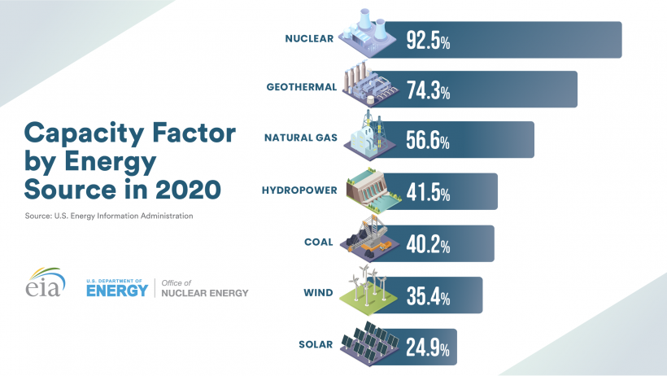

# The 2021 Texas Energy crisis: Exploratory simulation
  
The Texas Energy crisis was a series of rolling power blackouts that resulted in billions of dollars worth of loss, and estimated 151 lives lost.
A record cold wave hit the majority of mainland United States resulting in sustained temperatures well below 0 degrees celsius.
The contrast between the record temperatures induced by the coldwave and normal winter temperatures was particularly stark in the south of the United States.
The majority of homes and businesses in Texas rely on heating by resistive heating or reversed-refrigeration. In particular, over 60 % of
homes rely entirely on electrical power for heating. 
As many of the power generating facilities lacks winterization, all types of energy generation sources saw a reduction in a net generation. 
The combination of substantially increased demand and reduction in power generation lead to the decision of ERCOT to reduce load on the electrical grid. 
This was an unevitable outcome, as the ever strained power generation and increasing power demand will lead to a decrease in frequency unless load is shed. 
Such a frequency drop may damage equipment, and cause instability across the grid. In the United States power generation is synchronized to operate at 60 hz, with adverse affects occurring already at 0.6 hz decrease in frequency. 
The two largest energy sources, natural gas and wind power, went through the largest reductions in net output of all sources. 

In this analysis I will look at.....


The power generation and demand data used for this analysis is retrieved from the United States Energy Information Administration(EIA) and 

```{r, echo = FALSE, include=FALSE}

library(EIAdata)
library(fpp3)
library(forecast)
library(tidyverse)
library(magrittr)
library(lubridate)
library(x13binary)
library(stats)
library(harrypotter)
library(rugarch)
library(kableExtra)
library(seasonal)
`%notin%` <- Negate(`%in%`) #Adds  a custom inverse %in% function
load(file = "Data/texas_data.Rdata")
color_scheme <- c("black", "#EDA63A", "#5093F8",
                  "#34eb89", "#9d45f5",  "#f5455c",
                  "#0ac47d", "#b5070a", "#f57542") # General color scheme for plots 


texas_temperature <- read.csv("Data/texas_temperature.csv") %>%
  dplyr::select(NAME:TMIN) %>% 
  rename(station = NAME,
         date = DATE,
         temp_avg = TAVG,
         temp_min = TMIN,
         temp_max = TMAX) %>% 
  mutate(date = lubridate::ymd(date)) %>% 
  dplyr::select(date, station, temp_avg, temp_min, temp_max)

# Compose new dataframe where three station data is averaged
texas_temperature_avg <- texas_temperature %>% group_by(date) %>% 
  filter(!is.na(temp_avg)) %>% 
  summarise(temp_avg = mean(temp_avg),
            temp_min = min(temp_min), 
            temp_max = max(temp_max)) 

options(knitr.kable.NA = '')


```


## 1. Data exploration 


Unfortunately, the power generation data collected for this analysis only goes back to 2018 of july and as a result the table

```{r, echo = TRUE, include=TRUE, fig.width= 12, fig.height = 2}
# Minimum, 25%-percentile, Mean, Median, 75%-percentile and Maximum by month

# Create table data

table_power_input_data <- demand_data_daily %>% filter(date > "2018-07-01") %>% 
  left_join(generation_daily %>% filter(type == "total"), by = c("date")) %>% 
  filter(!is.na(mWh_generated))


tibble(Type = "Power demand", 
       Minimum = min(table_power_input_data$mWh_demand_daily), 
       Max = max(table_power_input_data$mWh_demand_daily),
       "Maximum date" = table_power_input_data[which.max(
         table_power_input_data$mWh_demand_daily),]$date,
       "Minimum date" = table_power_input_data[which.min(
         table_power_input_data$mWh_demand_daily),]$date,
       "25% - percentile" = quantile(table_power_input_data$mWh_demand_daily, 0.25),
       "75% - percentile" = quantile(table_power_input_data$mWh_demand_daily, 0.75)) %>% 
  bind_rows(
    tibble(Type = "Power generation", 
       Minimum = min(table_power_input_data$mWh_generated), 
       Max = max(table_power_input_data$mWh_generated),
       "Maximum date" = table_power_input_data[which.max
                                               (table_power_input_data$mWh_generated),]$date,
       "Minimum date" = table_power_input_data[which.min
                                               (table_power_input_data$mWh_generated),]$date,
       "25% - percentile" = quantile(table_power_input_data$mWh_generated, 0.25),
       "75% - percentile" = quantile(table_power_input_data$mWh_generated, 0.75)),) %>% 
  kbl(caption = "Summary statistics of power generaton and power demand in Texas (from 2018-07)") %>%
    kable_classic(full_width = F, html_font = "Times new roman") %>% 
  column_spec(6, width = "5em") %>%
  column_spec(7, width = "5em")

tibble("Maximum deviation" =max(
        table_power_input_data$mWh_demand_daily - table_power_input_data$mWh_generated),
        "Maximum deviation date" = table_power_input_data[which.max(
         max(table_power_input_data$mWh_demand_daily - 
         table_power_input_data$mWh_generated)),]$date) %>% 
    kbl(caption = "Maximum difference in power demand and total power generation") %>%
    kable_classic(full_width = F, html_font = "Times new roman")


                  
```

The temperatures are below are averages taken from three weather stations dispersed around the state of Texas. 

```{r, echo = TRUE, include=TRUE, fig.width= 12, fig.height = 2}
# Minimum, 25%-percentile, Mean, Median, 75%-percentile and Maximum by month

# Create table data

table_power_input_data <- demand_data_daily %>% filter(date > "2018-07-01") %>% 
  left_join(generation_daily %>% filter(type == "total"), by = c("date")) %>% 
  filter(!is.na(mWh_generated))


temperature_table_data <- texas_temperature %>% filter(!is.na(temp_max))
# Remove clear outliers
temperature_table_data %<>% filter(!temp_min < -40)

  
tibble("Average temperature" = mean(texas_temperature_avg$temp_avg),
       "Max average temperature" = max(texas_temperature_avg$temp_avg),
       "Max average temperature date" = texas_temperature_avg[which.max(
                                        texas_temperature_avg$temp_avg), ]$date,
       "Minimum average temperature" = min(texas_temperature_avg$temp_avg),
       "Minimum average temperature date" = texas_temperature_avg[which.min(
                                         texas_temperature_avg$temp_avg), ]$date, 
       "Absolute maximum temperature" = max(temperature_table_data$temp_max), 
       "Absolute maximum temperature date" = temperature_table_data[which.max(
                                             temperature_table_data$temp_max),]$date,
       "Absolute minimum temperature"       = min(temperature_table_data$temp_min),
       "Absolute minimum temperature date" = temperature_table_data[which.min(
                                           temperature_table_data$temp_min),]$date)   %>% 
  kbl(caption = "Summary temperature statistics") %>%
    kable_classic(full_width = F, html_font = "Times new roman")  %>% 
  column_spec(1, width = "5em") %>%
  column_spec(2, width = "5em") %>% 
  column_spec(3, width = "5em") %>%
  column_spec(4, width = "5em") %>% 
  column_spec(5, width = "5em") %>%
  column_spec(6, width = "5em") %>% 
  column_spec(7, width = "5em") %>%
  column_spec(8, width = "5em")


                  
```


In the few periods in which the flow of power to customers were not interrrupted, the prices rose in tandem with the shortage of power generation. Cases of several thousand dollar electricity bills were not uncommon


Power generation and demand in february
```{r, echo = TRUE, include=TRUE}
### Energy generation by source in february

demand_data_daily  %>% 
  filter(month(date) == 2 & 
           year(date) == 2021) %>% 
  ggplot() +
  geom_line(aes(x = date, y = mWh_demand_daily, col = "mWh demand")) +
  geom_line(aes(x = date, mWh_generated, col = "mWh generated" ),
            data = generation_daily %>% filter(
              month(date) == 2 &
              year(date) == 2021 &
              type == "total"
            )) +
  scale_colour_manual(values = color_scheme) +
  labs(title = "Demand vs power generation", subtitle = "in mWh",
       x = "Date", y = "mWh") +
  theme_bw()

```
We can see that net generation exceeds in particular around February 14th, where ERCOT decided to shed load to preserve grid stability. 
We will explore those days closer in the next plot.


```{r, echo = TRUE, include=TRUE}
### Closer look at load sheds days

#load_sheds <- data.frame(date = lubridate::ymd(c("2021-02-14")),
 #                        load_shed = c())

  
  
  
demand_data_daily  %>% 
  filter(date > "2021-02-07" &
         date < "2021-02-23") %>% 
  mutate(mWh_generated = (generation_daily %>% 
              filter(date > "2021-02-07" &
              date < "2021-02-23",
              type == "total"
            ))$mWh_generated) %>% 
  ggplot() +
  geom_line(aes(x = date, y = mWh_demand_daily, col = "mWh demand")) +
  geom_line(aes(x = date, mWh_generated, col = "mWh generated" )) +
  geom_ribbon(aes(x = date, ymin = mWh_demand_daily,
                  ymax = mWh_generated), fill = "grey") +
 geom_vline(xintercept = as.numeric(as.Date("2021-02-14")),
            linetype = 4, col = "#eb8034") +
  scale_colour_manual(values = color_scheme) +
  labs(title = "Demand vs power generation", subtitle = "in mWh. Vertical line represents load shed order issued by ERCOT",
       x = "Date", y = "mWh") +
  theme_bw() +
  scale_colour_discrete("Colour of series:")
  
  
  


```
By looking at the plot above we can see that the clear discrepenacy between power generation and demand, in particular the period directly leading up to the deciscion to perfom load shedding to preserve the grid.


```{r, echo = TRUE, include=TRUE}
### Energy generation by source in february
generation_daily  %>% 
  filter(month(date) == 2 & 
           year(date) == 2021 & 
           type %notin% c("total", "other")) %>% 
  ggplot(aes(x = date, y = mWh_generated)) + 
  geom_line(aes(col = type)) +
  scale_colour_manual(values = color_scheme) +
  labs(title = "Power generation for all major sources in Texas",
       subtitle = "in mWh",
       x = "Date", y = "mWh") +
  theme_bw() +
  scale_colour_discrete("Type of generation")


```
```{r, echo = TRUE, include=TRUE }
### Temperature averages

#knitr::opts_chunk$set(fig.width=12, fig.height=8) 
texas_temperature_avg   %>% 
  filter(date > "2021-01-15" & date < "2021-03-01")  %>% 
  mutate(year= year(date),
         date = seq(ymd("2021-01-16"), ymd("2021-02-28"), by  = "day")) %>%
  dplyr::select(year, date, temp_avg) %>% 
  bind_rows(
    texas_temperature_avg %>% 
      filter(date > "2011-01-15" & date < "2011-03-01") %>% 
      mutate(year= year(date),
             date = seq(ymd("2021-01-16"), ymd("2021-02-28"), by  = "day")) %>%
     dplyr::select(year, date, temp_avg)) %>% 
  mutate(year = as.factor(year)) %>% 
  ggplot() + 
  geom_line(aes(x = date, y = temp_avg, col = year)) +
  scale_colour_manual(values = c("black", "orange")) +
  labs(title = "Jan/February temperatures in degrees celsius",
       subtitle = "in 2011/2021",
       x = "Date", y = "Degrees celsius") +
  theme_bw() +
  scale_colour_discrete("Year observed")


```

Demand has changed a lot since 2000, and it begs to reason that choosing the last major cold wave gives a better representation of power demand in 2021. 
Based on the the last cold wave data, we will perform an arima simulation to find whether the demand 

```{r, echo = TRUE, include=TRUE, fig.width= 12, fig.height = 7}
### Temperature averages


texas_temperature_avg %>% 
  mutate(year = year(date),
         month = month(date, label = TRUE),
         day = day(date)) %>% 
  group_by(month, year) %>% 
  summarise(avg_temp_month = mean(temp_avg)) %>% 
  ggplot(aes(x = year, y = avg_temp_month, fill = year)) +
  geom_col() +
  scale_fill_hp(option = "LunaLovegood") +
  facet_wrap(~month) +
  labs(title = "Mean monthly temperature for the period 2000-2021",
       subtitle = "in degrees celsius",
       ylab = "Monthly average temperature in celsius",
       xlab = "Year") +
  theme_bw() + 
  theme(
    strip.background = element_rect(fill = "grey20", color = "grey80", size = 1),
    strip.text = element_text(colour = "white")
  )


```


```{r, echo = TRUE, include=TRUE}

arima_temperature_2011 <- texas_temperature_avg %>% 
  filter(date > "2011-01-16" &
           date < "2011-02-14") %>% 
  mutate(date = seq(ymd("2021-02-01"), ymd("2021-02-28"), by = "days")) %>% 
  as_tsibble(index = date)


unitroot_kpss(arima_temperature_2011$temp_avg) 

```

Simulation of power demand: 
To preserve the integrity of grid connected equipment, ERCOT began load shedding on february 14th. A week previously, weather forecasts gave dire news of record-low temperatures. In combination with previous cold-weather induced power outages such as in 2011 and 1989, it begs the question about whether such a crisis could have been predicted. A report from 2011, clearly states that power outages incurred by subzero temperatures is a clear risk given the lack of winterization measures present in a large share of power generation facilities in Texas. Assuming a scenario in which power generation has been severely reduced, we can forecast demand and find whether demand at any given point surpasses the total power generation present in the Texas grid. In such a scenario, parts of the grid will have to be disconnected, leaving families without heating and power dependent businesses without revenue. This is a greatly simplified exercise, as the net generation is assumed to fall at the levels observed in 2021. This of course, cannot be known in forehand (elaborate?). ERCOT (2021) estimates the peak reduction in power generation to be around 50 000 mWh.


A multivariate forecasting model with temperature as an added predictor could be assumed to give  a more accurate forecast than a univariate model using solely demand. The relationship between power demand and temperature can clearly be seen from figure (nr), in summer months (due to cooling needs) and winter months (due to heating needs). The use of a dynamic regression models as described in Hyndman(2021), allows for future assumed values of  a predictor to provide more information to the model. Using this method as a basis for forecasting, we can perform a monte-carlo like simulation using simulated data based on the 2011 observed temperatures. If such a simulation is performed sufficiently many times, some information about the probability of an exceeding forecasted demand may be retrieved. Exceeding demand is defined as a case in which demand at some point in the forecasted period surpasses our assumed maximum power generation. 


Using temperatures from 2011, the year in which the Groundhog Day Blizzard hit the southern states, simulated series are made using the coefficients and ARIMA orders of the fitted model. 

The plot below shows the residuals of observed temperatures of the cold peak in 2011. The PACF and ACF plot show, not surprisingly, some autocorrelation at lag 1, meaning that a given observation is correlated with the immediate previous observation. A KPSS test shows that the time series is sufficiently stationary that first order differencing is not necessary.


```{r, echo = TRUE, include=TRUE}
# facet plot of temperature

arima_temperature_2011 <- texas_temperature_avg %>% 
  filter(date > "2011-01-16" &
           date < "2011-02-14") %>% 
  mutate(date = seq(ymd("2021-02-01"), ymd("2021-02-28"), by = "days")) %>% 
  as_tsibble(index = date)

## Join observed demand and temperatures in a dataframe
demand_temp_2021 <- demand_data_daily %>% 
  left_join(texas_temperature_avg, by = "date") %>% 
  filter(date >= "2020-12-01" & date < "2021-02-01") %>% 
  as_tsibble(index = date)


demand_temp_2021 %<>% 
  rename("variable" = temp_avg)


unitroot_kpss(arima_temperature_2011$temp_avg) %>%
  kbl(caption = "Unitroot test on 2011 temperature data") %>%
    kable_classic(full_width = F, html_font = "Times new roman")

ggtsdisplay(arima_temperature_2011$temp_avg, 
            plot.type = "partial", 
            lag.max = 24, 
            theme = theme_bw(),
            main = "Non-differenced temperature data from 2011-01-16:2011-02-14")
```


The ARIMA() function provided in the fable r package allows us to iterate through all fitted arima models and choose the optimal model based on criterias such as Akakaike Information Criterion (AIC). The fitted ARIMA model will be passed to a custom arima simulation function, which outputs a generated series based on the coefficients and ARMA orders of the series. The series will closely resemble the observed time series, but will add needed randomness in the simulation. 


```{r, echo = TRUE, include=TRUE}
############ Fit arima series on 2011 weather data#################
fit_arima_temperature <- arima_temperature_2011 %>% 
  model(arima_temperature = ARIMA(temp_avg,
                                  stepwise = FALSE,
                                  approximation = FALSE))

```

Two functions are created with the intention of generating a arima series and performing the forecast by use of a dynamic regression model. The plot below shows an example generated series producd by the arima.sim() function of the stat package. A quick glance at the plot shows a clear similarity with the actual observed
series, and the temperature values generated seem plausible. 

```{r, echo = TRUE, include=TRUE}
options(width = 200)

arima_simulation <- function(fit,
                             days  = 30, 
                             start_date = "2021-02-01") 
  {
  #'Generates an optimized arima fit of based on the input dataframe
  #'on 'variable'. Based on the coefficients, AR and SMA orders, return
  #'a simulated ARIMA series. Outputs a tsibble 
  #'@df : input temperature dataframe
  #'@days: simulation duration
  #'@start_date: start date of the simulation
  
  ar_terms = (fit %>% 
                coefficients %>% 
                dplyr::filter(stringr::str_detect(term,"ar")))$estimate %>% 
    c(.)
  
  ma_terms = (fit %>% 
                coefficients  %>% 
                dplyr::filter(stringr::str_detect(term, "ma")))$estimate %>% 
    c(.)
  
  constant_term = (fit %>% coefficients %>% 
                     dplyr::filter(stringr::str_detect(term, "constant")))$estimate %>% 
    c(.)
  if (identical(constant_term, numeric(0))) constant_term <- 0
  if (identical(ma_terms, numeric(0))) {
    arima_sim_model = list(order = fit[[1]][[1]]$fit$spec[1:3] %>% 
                             t() %>% c(.), 
                           ar = ar_terms)
  }
  else {
    arima_sim_model = list(order = fit[[1]][[1]]$fit$spec[1:3] %>% 
                             t() %>% c(.), 
                           ar = ar_terms,
                           ma = ma_terms)
  }
  
  sigma = sd(residuals(fit)$.resid)
  
  sim_arima = arima.sim(model = arima_sim_model,
                                    n = days,
                                    sd = sigma)
  
  return( 
    data.frame(date = seq(from = ymd(start_date), length.out = length(sim_arima), by = "day"),
              variable = sim_arima ) %>% 
      mutate(variable = variable + constant_term + rnorm(n = 1, mean = 0, sd(sim_arima)))  %>% 
      as_tsibble(index = date)) 
}


## Print an example generated series

set.seed(4)
arima_simulation(fit_arima_temperature) %>% 
  ggplot(aes(x = date, y = variable)) +
  geom_line() +
  scale_colour_manual(values = color_scheme) +
  labs(title = "Example generated arima series",
       subtitle = "on 2011 temperature time series",
       x = "Date", y = "Degrees celsius") +
  theme_bw() 


forecast_sim <- function(ts, 
                         fit, 
                         days = 30, 
                         start_date = "2020-02-01") 
  {
  #' Function that performs a dynamic arima forecast based on a fitted 
  #' arima series. 
  #'@ts: timeseries or tsibble object of demand
  
  arima_sim = arima_simulation(fit, days, start_date)
  fit_demand = ts  %>% 
    model(arima_dynamic_demand = ARIMA(mWh_demand_daily~variable,
                                       stepwise = TRUE,
                                       approximation = FALSE))
  fc_demand = fit_demand %>% forecast(new_data = arima_sim)
  return (fc_demand)
  
}


```

A forecast is made based on the fitted values of a multivariate dynamic regression model. The generated series is assumed to be the future value of temperature, and passed as new data to compose the forecast. Below is an example forecast made by the  forecast_sim function. It calls the arima_simulation and uses its output as a basis for the assumed future temperatures. 

```{r, echo = TRUE, include=TRUE}

set.seed(15)
forecast_sim(demand_temp_2021,fit_arima_temperature, days = 30, start_date = "2021-02-01") %>% 
  ggplot(aes(x = date, y = .mean)) +
  geom_line() +
  scale_colour_manual(values = color_scheme) +
  labs(title = "Example dynamic forecast of demand",
       subtitle = "based on simulated temperatures and observed demand in 2021",
       x = "Date", y = "mWh demand") +
  theme_bw() 


```


Every value of forecasted peak demand is recorded and checked whether it surpasses the assumed peak power generation. The simulation is conducted 1000 times, and leaves us with a fully populated dataframe. Based on this, some probability of observing demand surpassing the assumed peak demand. 

```{r, echo = TRUE, include=TRUE}

set.seed(1234)
max_generation <- (generation_daily %>% dplyr::filter(type == "total") %>% 
                     arrange(desc(mWh_generated)))[1,]$mWh_generated


tibble("Max power generation" = max_generation ) %>% 
  kbl(caption = "Observed max generation 2021") %>% 
  footnote(general  = "in mWh") %>% 
  kable_classic(full_width = F, html_font = "Times new roman")
```

Table 5 shows the 


```{r, echo = TRUE, include=TRUE}

## Any forecasted daily demand over estimated max_generation 

demand_exceeded <- data.frame("run_nr" = seq(1, 1000), 
                              exceed = FALSE,
                              max_demand = 0)
for(i in 1:1000) {
  fc_sim = forecast_sim(ts = demand_temp_2021, fit = fit_arima_temperature )
  
  max_demand = max(fc_sim$.mean)
  demand_exceeded[i, "max_demand"] <- max_demand
  if (max_demand > max_generation)  demand_exceeded[i, "exceed"] <- TRUE
}


demand_exceeded %>% 
  summarise(count = sum(exceed, na.rm = TRUE), 
            "Percentage" = paste((count/n())*100, "%"),
            "Mean demand observed"  = mean(max_demand),
            "Max demand observed"   = max(max_demand)) %>% 
  rename("Number of simulations exceeding peak generation" = count) %>% 
  kbl(caption = "Forecasted simulated demand on 2011 temperatures ", align = "c") %>%
  kable_paper(full_width = F) %>%
  footnote(general  = "Based on 1000 simulations") %>% 
  kable_classic(full_width = F, html_font = "Times new roman")


```

The table above (table 6) is the result of running the simulation for a 1000 runs, and recording max demand as well as the number of simulated runs in which demand surpasses assumed peak power generation. A total of 45 simulation runs forecasted demands which surpasses peak generation at least one day, amounting to 4.5 % of all simulation runs. The mean observed is way below the assumed peak generation of 60880 mWh, some simulation runs yields forecasted demand way above the peak generation limit, maxing at 74769 mWh. The percentage of cases where demand exceeded power generation may not seem high, but considering the  catastrophic consequences which a potential grid failure implies, the risk may be considerable. 

A note should be made about the temperatures observed in early february 2011. Although the temperatures observed were abnormally low, they were not however extreme. As shown in a previous chart, the temperatures observed in 2021 were unique not in its record low temperatures but rather the duration in which the low temperatures persisted. The simulation results, though based on rough assumptions, does not seem exaggerated based on its assumed temperature data. 


In summary, some evidence has provided that a real to the power grid could have been foreseen two weeks ahead of the power failure. This analysis has used data available at February 1 2021. 


## Simulation of power generation: Experiments with Nuclear power generation. 

As we have previously seen, the extent to which reductions in power output occurred, various greatly from power source to power source. Although several wind power critics released fiery remarks about the misfortune of wind power, it is now clear that wind were only partly to blame and that early estimates overestimated the reduction in wind output (Texas Tribune 2021).  The capacity factor of a power generation source describes the relation of potential power production (its nameplate value) and the actual average power output. Of all power sources. 


```{r, echo = TRUE, include=TRUE}

#


```


```{r, echo = TRUE, include=TRUE}

garch_sim <- function(fit, df, fc_length = 20, start_date = "2021-02-01") {
  #'
  #'@fit: fitted arima model
  #'@fc_length: 
  arma_order <- fit[[1]][[1]]$fit$spec[1:3] %>% dplyr::select(p,q) %>% 
    t(.) %>% c(.)
  spec_ugarch = ugarchspec(
    mean.model <- list(armaOrder = arma_order,  include.mean = TRUE),
    variance.model= list(model="sGARCH", garchOrder=c(1,1)))
  
  fit_ugarch = ugarchfit(data = df$mWh_generated, spec = spec_ugarch, out.sample = fc_length)
  return(tsibble(mWh_generated = ugarchsim(fit_ugarch, 
                                          n.sim = fc_length, 
                                          n.start = 0, 
                                          startMethod = "sample", 
                                          m.sim = 1)@simulation$seriesSim,
                date = seq(ymd(start_date), length.out = fc_length, by = "day")))
}


```


## References


Hyndman, R. J., & Athanasopoulos, G. (2021). Forecasting: Principles and Practice (3rd edition). https://otexts.com/fpp3/
